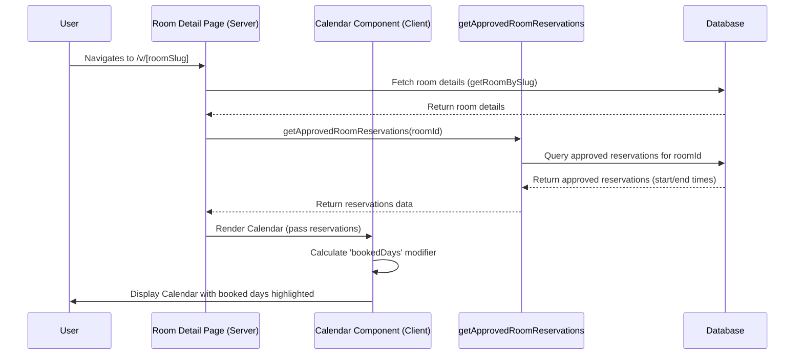

# Plan: Calendar View for Room Availability

**Priority:** High (as decided)

**Goal:** Display a visual calendar on the room detail page indicating when the room is already booked with _approved_ reservations.

## Implementation Steps:

1.  **Backend (API/Server Action):**

    - **Goal:** Create a way to fetch _approved_ reservations for a specific room.
    - **Action:** Define a new server action, potentially named `getApprovedRoomReservations(roomId: number)`, which queries the database for reservations associated with the `roomId` that have an 'approved' status. It should return an array of objects containing at least the `start_time` and `end_time` for each approved reservation.
    - **File:** Likely within `src/features/reservations/api/` or a similar location.

2.  **Room Detail Page (`src/app/(landing-page)/v/[roomSlug]/page.tsx`):**

    - **Goal:** Fetch the reservation data alongside the room details.
    - **Action:**
      - Keep the existing logic to fetch `room` data using `getRoomBySlug`.
      - After getting the `room.id`, call the new `getApprovedRoomReservations(room.id)` server action to get the list of approved bookings.
      - Pass this list of reservations as a prop (`approvedReservations`) to a new client component responsible for rendering the calendar.

3.  **New Client Component (`src/features/rooms/components/room-availability-calendar.tsx`):**

    - **Goal:** Display a calendar highlighting booked dates.
    - **Action:**
      - Create this new component that accepts the `approvedReservations` array prop.
      - Use the existing Shadcn UI `<Calendar>` component (`react-day-picker`).
      - Process the `approvedReservations` prop to create a `bookedDays` modifier. This modifier should include all dates that fall between the `start_time` and `end_time` of any approved reservation. Consider handling multi-day reservations correctly.
      - Render the `<Calendar>` component, passing the `bookedDays` modifier to visually distinguish booked dates (e.g., using `styles` or `classNames` props of `react-day-picker`).
      - This calendar will initially be read-only.

4.  **Integration:**
    - **Goal:** Place the new calendar component on the room detail page.
    - **Action:** Import and render the `<RoomAvailabilityCalendar approvedReservations={approvedReservations} />` component within the main return statement of the room detail page (`.../[roomSlug]/page.tsx`), placing it logically (e.g., near the room description or booking section).

## Conceptual Flow:

